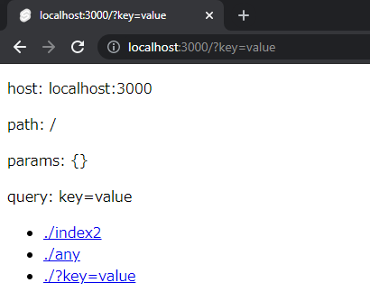
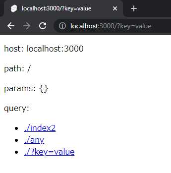

# SvelteKit static build query issues

This is reproduction repository. I can't get correct queries if I build with `@sveltejs/adapter-static`.

## procedure for reproducing

### create project

```sh
npm init svelte@next sveltekit-static-query
cd sveltekit-static-query
pnpm i @sveltejs/adapter-static@next sirv-cli
# and edit src/routes/*.svelte files
```

### launch

```sh
# pnpm dev # -> WORKS FINE
# pnpm build && pnpm preview # -> WORKS FINE
pnpm build && pnpm start # -> Does not work properly
```

1. Start server with `pnpm build && pnpm start`
2. Access to http://localhost:3000
3. Click [./?key=value](http://localhost:3000/?key=value) (Maybe works properly like fig1 below)
4. RELOAD!! And disappear `query` value (Does not work properly like fig2 below)

|||
|:-----------------:|:-----------------:|
|fig1               |fig2               |

Other links are simple demos.
